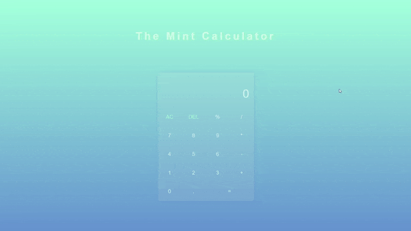

# Mint Calculator
This is the Mint calculator. It is just like a regular calculator, but with a little bit of style. 

**Link to project:** https://johnsebastian3.github.io/mint-calculator/

## How It's Made:

**Tech used:** HTML, CSS, JavaScript

This was made using CSS Grid for the calculator buttons. JS was used for the calculator logic.

## Optimizations

Optimizations planned are refactoring code to use OOP.

## Lessons Learned:

I learned a lot about how to work with numbers in JS during this project. This project really tested my ability to debug and refactor.
